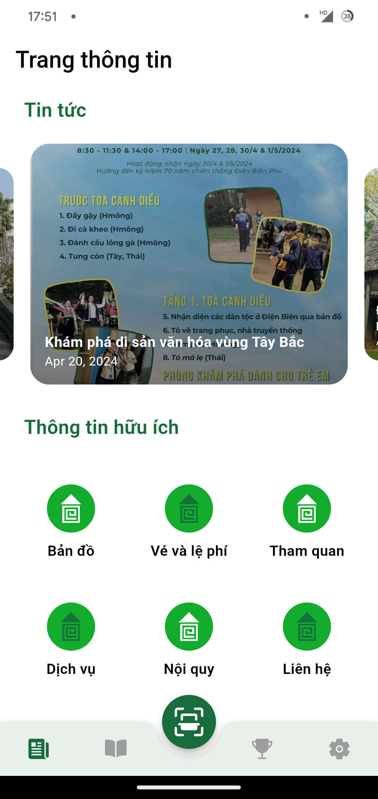
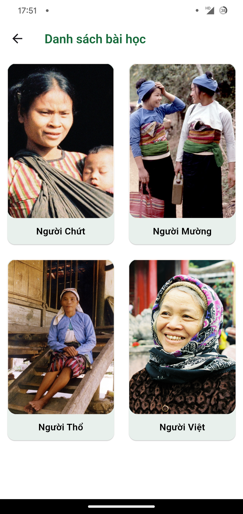

# VMEducation

Ứng dụng di động giáo dục về lịch sử và văn hóa, cung cấp thông tin, hình ảnh và mô hình 3D của các cổ vật tại Bảo tàng Dân tộc học Việt Nam, nhằm nâng cao trải nghiệm của người dùng với sự hỗ trợ của công nghệ AR.

## Tải ứng dụng

Để cài đặt ứng dụng, bạn cần cài đặt cả file APK chính và file APK plugin cho AR tại [đây](https://github.com/tedomi2705/vmeducation/releases).

Yêu cầu hệ thống: Android 12 trở lên.

Lưu ý: Để sử dụng được tính năng AR, bạn cần phải cài plugin AR và thiết bị của bạn cần hỗ trợ ARCore. Bạn có thể kiểm tra tại [đây](https://developers.google.com/ar/discover/supported-devices).

## Tính năng chính

* Tra cứu thông tin
* Tham gia bài học
* Xem và tương tác với mô hình 3D

## Công nghệ sử dụng

* Flutter
* ARCore

## Ảnh chụp màn hình

  
   
  

## Giấy phép

    Copyright 2024 VMEducation

    Licensed under the Apache License, Version 2.0 (the "License");
    you may not use this file except in compliance with the License.
    You may obtain a copy of the License at

    http://www.apache.org/licenses/LICENSE-2.0

    Unless required by applicable law or agreed to in writing, software
    distributed under the License is distributed on an "AS IS" BASIS,
    WITHOUT WARRANTIES OR CONDITIONS OF ANY KIND, either express or implied.
    See the License for the specific language governing permissions and
    limitations under the License.

## Tuyên bố từ chối trách nhiệm
Nhà phát triển ứng dụng này không có bất kỳ liên kết nào với Bảo tàng Dân tộc học Việt Nam.